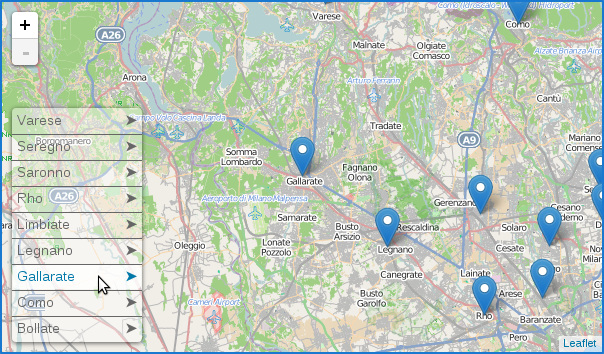

# Leaflet List Markers

A Leaflet Control for listing visible markers in the map.

Initially based on the [work](https://github.com/stefanocudini/leaflet-list-markers) of Stefano Cudini.



## Options

Only the following of the [original options](src/leaflet-list-markers.js#L7-L20) were considered:

*	collapsed: true / false
*	update: true / false
* maxheight: 0.7
*	maxwidth: 0.5

## Events

* item-mouseover
* item-mouseout
* item-click (new)
* update-end (new)

## Quick Start

* Create a leaflet map. Checkout Leaflets [Quick Start Guide](http://leafletjs.com/examples/quick-start.html) for a basic map example.
* [Download](https://raw.githubusercontent.com/hupe13/leaflet-list-markers/refs/heads/master/src/leaflet-list-markers.js) and include leaflet-list-markers.js
* [Download](https://raw.githubusercontent.com/hupe13/leaflet-list-markers/refs/heads/master/src/leaflet-list-markers.css) and include leaflet-list-markers.css

```html
<script src="src/leaflet-list-markers.js"></script>
<link rel="stylesheet" href="src/leaflet-list-markers.css" />
```

Adding the List control to the map:

```
map.addControl( new L.Control.ListMarkers({layer: markersLayer}) );
//markersLayer is a L.LayerGroup contains listing markers
```
Short way:
```
var map = new L.Map('map', { listMarkersControl: {layer: markersLayer} });
```

## Examples

* <a href="https://hupe13.github.io/leaflet-list-markers/examples/simple.html">Simple</a> (Stefano Cudini), <a href="examples/simple.html">Code</a>
* <a href="https://hupe13.github.io/leaflet-list-markers/examples/simple-collapsed.html">Collapsed</a>, <a href="examples/simple-collapsed.html">Code</a>
* You can use it with WordPress, [Leaflet Map](https://wordpress.org/plugins/leaflet-map/) and [Extensions for Leaflet Map](https://wordpress.org/plugins/extensions-leaflet-map/) (<a href="https://github.com/hupe13/extensions-leaflet-map-github">in preparation</a>, <a href="https://leafext.de/en/listmarker/listmarker/">Example</a>)
